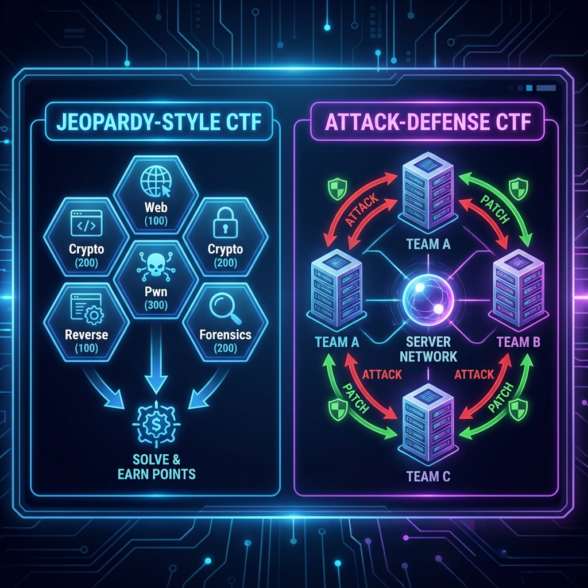

# The Comprehensive Guide to CTF Competitions

## Table of Contents
1.  [Chapter 1: Introduction to CTFs & Ethics](#chapter-1-introduction-to-ctfs--ethics)
2.  [Chapter 2: Cryptography](#chapter-2-cryptography)
3.  [Chapter 3: Web Exploitation](#chapter-3-web-exploitation)
4.  [Chapter 4: Forensics](#chapter-4-forensics)
5.  [Chapter 5: Reverse Engineering & Binary Exploitation](#chapter-5-reverse-engineering--binary-exploitation)
6.  [Chapter 6: Networking & Reconnaissance](#chapter-6-networking--reconnaissance)

---

# Chapter 1: Introduction to CTFs & Ethics

## 1.1 What are CTFs?
Capture The Flag (CTF) competitions are gamified cybersecurity exercises where participants—either individually or in teams—are challenged to solve security puzzles. The goal is to find a hidden string of text, known as a "flag," which is usually in the format `CTF{s0m3_l33t_str1ng}`.

### Types of CTFs
There are several formats of CTFs, each testing different skill sets.



1.  **Jeopardy-Style:**
    *   **Format:** Similar to the TV show Jeopardy! Board of challenges categorized by topic (Web, Crypto, Pwn, Forensics) and difficulty.
    *   **Scoring:** Points are awarded for each solved challenge. Harder challenges yield more points.
    *   **Best For:** Beginners and learning specific skills. This is the most common format.

2.  **Attack-Defense:**
    *   **Format:** Each team is given a vulnerable server to defend. They must patch their own vulnerabilities while exploiting the same vulnerabilities on other teams' servers.
    *   **Scoring:** Points are gained for capturing flags from opponents (Attack) and maintaining service uptime (Defense/SLA).
    *   **Skills:** Requires rapid patch analysis, network monitoring, and exploit automation.

3.  **King of the Hill (KotH):**
    *   **Format:** Players compete to gain control of a machine and maintain access for the longest time.

## 1.2 Ethics and Legal Frameworks
Hacking skills are like superpowers—they can be used for good or evil. Understanding the boundary is critical.

### The "Hat" Terminology
*   **White Hat:** Ethical hackers who secure systems. They have permission to test and report vulnerabilities.
*   **Black Hat:** Malicious hackers who break into systems for personal gain, destruction, or fame. **Illegal.**
*   **Gray Hat:** Operates in a moral gray area, often finding vulnerabilities without permission but reporting them instead of exploiting them. **Still risky and often illegal.**

### Rules of Engagement (RoE)
Before touching any system, you must know the RoE.
1.  **Authorized Access Only:** Never target a system you don't own or have explicit written permission to test.
2.  **Scope:** Know clearly what is in-scope (allowed) and out-of-scope (forbidden). E.g., attacking the application is okay, but DDoS-ing the server is usually banned.
3.  **Responsible Disclosure:** If you find a bug in the wild, report it securely to the vendor (e.g., via Bugcrowd, HackerOne, or security.txt).

## 1.3 Setting Up Your Lab
You need a safe environment to practice attacking without risking your personal computer.

### Step-by-Step: Installing Kali Linux on VirtualBox

**Step 1: Download the Hypervisor**
*   Download and install **VirtualBox** (free) or **VMware Workstation Player**.
*   This software allows you to run a "computer inside a computer."

**Step 2: Download the Guest OS**
*   Go to [kali.org/get-kali](https://www.kali.org/get-kali/) and download the "Virtual Machines" pre-built image for VirtualBox.
*   *Why Kali?* It comes pre-installed with hundreds of hacking tools (Metasploit, Burp Suite, unrar, etc.).

**Step 3: Import the Appliance**
1.  Open VirtualBox.
2.  File -> Import Appliance.
3.  Select the downloaded `.ova` file.
4.  Click "Import".

**Step 4: Network Configuration (Crucial!)**
*   **NAT Network:** Your VM can access the internet, but the internet can't access your VM. Safe default.
*   **Bridged Adapter:** Your VM appears as a separate device on your local Wi-Fi. Useful for Attack-Defense but riskier on public networks.

**Step 5: Snapshots**
*   Before doing anything risky (or breaking your config), take a **Snapshot**. This saves the current state of the VM so you can revert to it instantly if everything breaks.

### Basic Linux Skills
The terminal is your home.
*   `ls -la`: List all files, including hidden ones.
*   `cd /path/to/dir`: Change directory.
*   `pwd`: Print working directory.
*   `sudo command`: Run as root (administrator).
*   `man command`: Read the manual for a command (e.g., `man grep`).

---

# Chapter 2: Cryptography

## 2.1 Introduction to Cryptography
Cryptography is the backbone of secure communication. In CTFs, you face "broken" crypto—weak logic, leaked keys, or implementation errors.

### Encoding vs. Encryption vs. Hashing
Understanding the difference is critical.

| Type | Reversible? | Key Required? | Purpose | Example |
| :--- | :--- | :--- | :--- | :--- |
| **Encoding** | Yes | No | Usability / Formatting | Base64, Hex, ASCII |
| **Encryption** | Yes | Yes | Confidentiality | AES, RSA |
| **Hashing** | No | No | Integrity | SHA-256, MD5 |

## 2.2 Classical Ciphers
These are historical ciphers. They are insecure but frequent in beginner CTFs.

### Caesar Cipher (Shift Cipher)
*   **Concept:** Shift every letter by $N$ positions.
*   **Weakness:** Only 25 possible keys (in English). Trivial to brute-force.
*   **Math:** $C = (P + K) \pmod{26}$

### Vigenère Cipher
*   **Concept:** Polyalphabetic substitution using a keyword.
*   **Weakness:** Vulnerable to frequency analysis if the text is long enough. 
*   **Tool:** Use [dcode.fr](https://www.dcode.fr/vigenere-cipher) or Kasiski test.

## 2.3 Modern Symmetric Cryptography
The same key is used for encryption and decryption.

### XOR (Exclusive OR)
The most important operator in CTF crypto.
*   **Truth Table:**
    *   0 XOR 0 = 0
    *   0 XOR 1 = 1
    *   1 XOR 0 = 1
    *   1 XOR 1 = 0
*   **Property:** $A \oplus B = C$ and $C \oplus B = A$. It is its own inverse.
*   **One-Time Pad (OTP):** If the key is random and as long as the message, it is mathematically unbreakable.

### AES (Advanced Encryption Standard)
*   **Block Cipher:** Encrypts data in fixed-size blocks (128 bits).
*   **Modes of Operation:**
    *   **ECB (Electronic Codebook):** Weak. Same plaintext block always equals same ciphertext block. Patterns remain visible (e.g., the Tux penguin image).
    *   **CBC (Cipher Block Chaining):** Secure. Uses an IV (Initialization Vector) to randomize the first block.

## 2.4 Modern Asymmetric Cryptography
Uses a Public Key (encrypt) and Private Key (decrypt).

### RSA (Rivest–Shamir–Adleman)
Security relies on the difficulty of factoring large semiprime numbers.
*   **Variables:**
    *   $p, q$: Large prime numbers.
    *   $N = p \times q$: The modulus (Public).
    *   $e$: Public exponent (usually 65537).
    *   $d$: Private exponent (Secret).
*   **Attacks:**
    *   **Small N:** Factorize $N$ using online databases (factordb.com).
    *   **Small e:** If $e=3$, susceptible to cube root attacks.

## 2.5 Practical Guide: Breaking Codes

### Step-by-Step: Multi-Layer Decoding with CyberChef
Often, flags are encoded multiple times (e.g., Base64 -> Hex -> Rot13).

1.  **Open CyberChef:** [https://gchq.github.io/CyberChef/](https://gchq.github.io/CyberChef/)
2.  **Input:** Paste the "gibberish" string into the Input box.
3.  **Recipes:** Dragon-and-drop "Magic" block into the Recipe area.
4.  **Analyze:** If "Magic" fails, look at the format.
    *   Ends in `=`? Try "From Base64".
    *   Only 0-9, A-F? Try "From Hex".
    *   Readable but scrambled? Try "ROT13".

### Step-by-Step: Cracking Hash Passwords
You found a hash in a database dump: `5f4dcc3b5aa765d61d8327deb882cf99`.

1.  **Identify:** Use `hash-identifier` in Kali or an online tool. Result: MD5.
2.  **Wordlist:** Locate `rockyou.txt` in Kali (`/usr/share/wordlists/rockyou.txt.gz`). Unzip it.
3.  **Hashcat:**
    *   Command: `hashcat -m 0 -a 0 hash.txt rockyou.txt`
    *   `-m 0`: Mode 0 (MD5).
    *   `-a 0`: Attack mode 0 (Wordlist).
4.  **Result:** The tool will output the plaintext password.

<!-- Placeholder: [Image: sym_vs_asym_enc.png] - Diagram showing shared key vs public/private key flows -->
<!-- Placeholder: [Image: hashing_visual.png] - Visualizing how different inputs produce fixed-length hashes -->

---

# Chapter 3: Web Exploitation

## 3.1 Understanding the Web
The web is the most common attack surface. To exploit it, you must understand how it works.

### HTTP/S Protocol
*   **Request/Response Cycle:** Client sends a request, Server processes it and sends a response.
*   **Methods:**
    *   `GET`: Retrieve data. Data is visible in URL parameters.
    *   `POST`: Submit data. Data is in the body, not visible in URL.
    *   `PUT`/`DELETE`: Modify resources.
*   **Headers:**
    *   `Cookies`: Maintain state (login sessions) since HTTP is stateless.
    *   `User-Agent`: Identifies the client software.

## 3.2 SQL Injection (SQLi)
The most devastating web vulnerability. It allows an attacker to interfere with the queries an application makes to its database.

<!-- Placeholder: [Image: sqli_diagram.png] - Visualizing how malicious input alters the SQL query structure -->

### Types of SQLi
1.  **Union-Based:** Uses the `UNION` operator to combine the results of the original query with the results of an injected query. The results are visible on the page.
2.  **Error-Based:** Intentionally malformed queries cause the database to error, revealing information about its structure.
3.  **Blind SQLi:** The application doesn't return data or errors, but behaves differently (e.g., takes longer to load) based on whether the injected query is true or false.

### Step-by-Step: Manual Union SQL Injection
**Goal:** Extract the `admin` password.
**Scenario:** A search bar at `http://target.com/search?q=apple`.

1.  **Test for vulnerability:** Input `'`. If the page breaks or errors, it's likely vulnerable.
2.  **Determine column count:**
    *   `' ORDER BY 1 --` (No error)
    *   `' ORDER BY 2 --` (No error)
    *   `' ORDER BY 3 --` (Error!) -> Therefore, there are 2 columns.
3.  **Find the display point:**
    *   `' UNION SELECT 1, 2 --` -> See where "1" and "2" appear on the page.
4.  **Extract Data:**
    *   `' UNION SELECT username, password FROM users --` -> The page now displays user credentials instead of "1" and "2".

## 3.3 Cross-Site Scripting (XSS)
XSS allows attackers to execute malicious scripts in the victim's browser.

<!-- Placeholder: [Image: xss_flowchart.png] - The path of a malicious script from attacker to victim browser -->

### Types of XSS
1.  **Reflected XSS:** The script is part of the request (e.g., in the URL) and reflects off the server.
    *   *Attack Vector:* Phishing link.
2.  **Stored XSS:** The script is stored in the database (e.g., a forum post).
    *   *Attack Vector:* Anyone who views the page is attacked.
3.  **DOM-Based:** The vulnerability exists in the client-side JavaScript code.

### Step-by-Step: Intercepting Requests with Burp Suite
Burp Suite is the #1 tool for web hacking.

1.  **Setup:**
    *   Open Burp Suite Community Edition.
    *   Open the embedded browser (Proxy -> Open Browser).
2.  **Intercept:**
    *   Turn "Intercept is on" in the Proxy tab.
    *   Navigate to a website in the embedded browser.
    *   The request will "hang" in Burp. You can now see and edit it.
3.  **Modify:**
    *   Double-click any parameter (e.g., `price=10`).
    *   Change it to `price=0`.
    *   Click "Forward".
4.  **Result:** Check if you bought the item for free!

## 3.4 Command Injection
Remote Code Execution (RCE) via the shell.

*   **Vulnerability:** Input is passed directly to a system shell command (e.g., `system("ping " + input)`).
*   **Exploit:** Use separators to add your own command.
    *   `;` (Unix)
    *   `&&` (Success only)
    *   `||` (Failure only)
    *   Example: `127.0.0.1; cat /etc/passwd`

---

# Chapter 4: Forensics

## 4.1 Digital Anatomy
Forensics is about finding the truth hidden in data. It requires understanding how data is structured on disk and in transit.

### File Signatures (Magic Bytes)
Operating systems rely on extensions (`.jpg`), but tools rely on headers.
*   **PNG:** `89 50 4E 47 0D 0A 1A 0A`
*   **JPEG:** `FF D8 FF E0`
*   **ZIP:** `50 4B 03 04` (PK..)
*   **PDF:** `25 50 44 46` (%PDF)

<!-- Placeholder: [Image: file_header_visual.png] - Hex editor view highlighting magic bytes -->

### Corrupted Headers
A common CTF trick is to corrupt the magic bytes so the file doesn't open.
*   **Fix:** Open in a Hex Editor (e.g., `hexeditor` or `HxD`) and restore the correct bytes.

## 4.2 Network Forensics (Packet Analysis)
Analyzing captured network traffic (`.pcap` files).

### The OSI Model
Understanding layers helps you find flags.
1.  **Physical** (Cables)
2.  **Data Link** (MAC addresses)
3.  **Network** (IP addresses)
4.  **Transport** (TCP/UDP ports)
5.  **Session**
6.  **Presentation** (Encryption/Encoding)
7.  **Application** (HTTP, FTP, SMTP) -> **Focus Here!**

<!-- Placeholder: [Image: osi_model_layers.png] - The 7 layers of the OSI model with relevant CTF protocols -->

### Step-by-Step: Analyzing Traffic with Wireshark
**Scenario:** You have a `capture.pcap` file.

1.  **Open:** `wireshark capture.pcap`
2.  **Protocol Hierarchy:** Go to `Statistics -> Protocol Hierarchy`. This gives a bird's-eye view. Is there HTTP? FTP?
3.  **Follow Streams:** Right-click a packet -> `Follow -> TCP Stream`. This reconstructs the full conversation. Look for:
    *   Login credentials (plaintext).
    *   File transfers.
4.  **Export Objects:** Go to `File -> Export Objects -> HTTP`. This automatically extracts images, scripts, or zips downloaded during the capture.

## 4.3 Steganography
The art of hiding secrets in plain sight.

### LSB (Least Significant Bit)
Images are made of pixels (RGB). Each color channel is 8 bits (0-255).
*   Changing the last bit (0000000**1** vs 0000000**0**) changes the color imperceptibly.
*   Attackers hide binary data in these LSBs.
*   **Tool:** `zsteg` (for PNG/BMP) instantly reveals LSB data.

### Step-by-Step: Extracting Hidden Files with Binwalk
**Scenario:** You have an image `challenge.jpg` that is unusually large.

1.  **Analyze:** Run `binwalk challenge.jpg`.
    *   Output: `DECIMAL: 0, DESCRIPTION: JPEG image...`
    *   Output: `DECIMAL: 45023, DESCRIPTION: Zip archive data...`
2.  **Extract:** Run `binwalk -e challenge.jpg`.
3.  **Result:** It creates a `_challenge.jpg.extracted` folder containing the hidden zip file.

---

# Chapter 5: Reverse Engineering & Binary Exploitation

## 5.1 Memory Layout
To exploit a program, you must know how it lives in memory.

<!-- Placeholder: [Image: stack_memory_layout.png] - Visualization of the stack frame, return address, and buffer overflow direction -->

1.  **Text Segment:** The actual machine code (Read-Only).
2.  **Data Segment:** Global variables (initialized).
3.  **Heap:** Dynamic memory (grows upwards). Used by `malloc()`/`new`.
4.  **Stack:** Local variables (grows downwards). Used by function calls. **Most common attack surface.**

## 5.2 CPU Registers (x86)
Registers are super-fast storage locations inside the CPU.

<!-- Placeholder: [Image: cpu_registers_diagram.png] - Map of common registers (EAX, ESP, EIP) and their roles -->

*   **EAX (Accumulator):** Stores return values of functions.
*   **ESP (Stack Pointer):** Points to the top of the stack.
*   **EBP (Base Pointer):** Anchors the bottom of the stack frame.
*   **EIP (Instruction Pointer):** **The most critical register.** It controls what instruction runs next. If you control EIP, you control the program.

## 5.3 Reverse Engineering Workflow
The goal is to understand the logic without source code.

### Step-by-Step: Decompiling with Ghidra
**Scenario:** You have a binary `auth` that asks for a password.

1.  **Import:** Open Ghidra, create a project, and import `auth`.
2.  **Analyze:** Double-click `auth` to open the CodeBrowser. When asked to "Analyze?", click "Yes" (Defaults are fine).
3.  **Symbol Tree:** On the left, expand "Functions". Look for `main`.
4.  **Decompile:** Click `main`. The window on the right ("Decompile") shows semi-readable C code.
5.  **Read:** Look for logic like:
    ```c
    if (strcmp(input, "SuperSecretPassing") == 0) {
        give_flag();
    }
    ```
6.  **Solve:** The password is `SuperSecretPassing`.

## 5.4 Binary Exploitation (Pwn)
Breaking the program to run your own code (Shellcode).

### Buffer Overflow
A buffer overflow happens when a program reads more data into a fixed-size buffer than it can hold.

**The Logic:**
1.  Variable `buffer` is allocated 64 bytes on the stack.
2.  Important data (like the **Return Address**) sits right next to it.
3.  User inputs 100 bytes.
4.  The first 64 fill the buffer. The remaining 36 spill over ("overflow") and overwrite the Return Address.
5.  When the function finishes (`ret`), the CPU tries to jump to the overwritten address.
6.  If you overwrite it with the address of "Give Shell" function -> **You win.**

### Step-by-Step: Analysis with GDB
**Scenario:** `vuln` crashes when you give it long input.

1.  **Start GDB:** `gdb ./vuln`
2.  **Run:** `r` -> Program starts.
3.  **Crash it:** Type `AAAAAAAAAA...` (lots of A's).
4.  **Check Crash:** Program stops with `Segmentation fault`.
5.  **Inspect EIP:** `info registers`.
    *   If `eip` is `0x41414141` (`AAAA`), it means you successfully controlled the execution pointer.

---

# Chapter 6: Networking & Reconnaissance

## 6.1 The Language of the Internet (TCP/IP)
Hacking is often just manipulating network traffic.

### The TCP 3-Way Handshake
Before data sends, a connection must be established. This is polite networking.

<!-- Placeholder: [Image: tcp_handshake.png] - SYN, SYN-ACK, ACK flow diagram -->

1.  **SYN:** Client sends "Hello, I want to talk" (Synchronization).
2.  **SYN-ACK:** Server sends "Okay, I'm listening" (Synchronization + Acknowledgment).
3.  **ACK:** Client sends "Great, let's start" (Acknowledgment).

*   **CTF Tip:** A "SYN Scan" (Nmap default) sends step 1. If it gets step 2 back, the port is open. It never sends step 3, making it slightly stealthier.

### Subnetting (CIDR Notation)
*   `192.168.1.0/24`: The "slash 24" means the first 24 bits (3 octets) are fixed.
    *   IPs range from `192.168.1.1` to `192.168.1.254`.
*   `127.0.0.1`: Localhost (Your own computer).

## 6.2 Reconnaissance (Enumeration)
"Give me six hours to chop down a tree and I will spend the first four sharpening the axe." - Abraham Lincoln.

### Active Scanning with Nmap
Nmap is the King of Scanners.

<!-- Placeholder: [Image: nmap_scan_types.png] - Visualizing different scan techniques -->

#### Step-by-Step: Enumerating a Target
**Target:** `10.10.10.5`

1.  **Quick Scan:**
    *   Command: `nmap -sC -sV 10.10.10.5`
    *   `-sC`: Use default scripts (finds titles, headers).
    *   `-sV`: Probe open ports to determine service/version info.
2.  **Full Port Scan:**
    *   Command: `nmap -p- 10.10.10.5`
    *   Scans all 65,535 ports. Critical if SSH is hidden on port 2222.
3.  **UDP Scan:**
    *   Command: `nmap -sU 10.10.10.5`
    *   Slow, but finds things like SNMP or TFTP.

### Directory Busting (Web Recon)
Finding hidden folders on a web server.
*   **Tools:** `gobuster`, `dirb`, `dirsearch`.
*   **Concept:** The tool has a list of words (`admin`, `login`, `backup`). It asks the server: "Do you have /admin?".
*   **Command:** `gobuster dir -u http://10.10.10.5 -w /usr/share/wordlists/dirb/common.txt`

## 6.3 The Swiss Army Knife: Netcat
Netcat (`nc`) reads and writes data across network connections.

*   **Connect to a port:** `nc [IP] [PORT]`
    *   Example: `nc 10.10.10.5 1337` (Connect to a challenge service).
*   **Listen on a port:** `nc -lvnp [PORT]`
    *   `-l`: Listen mode.
    *   `-v`: Verbose.
    *   `-n`: No DNS lookup (faster).
    *   `-p`: Port number.
    *   Example: `nc -lvnp 4444` (Waiting for a reverse shell to connect back to you).
